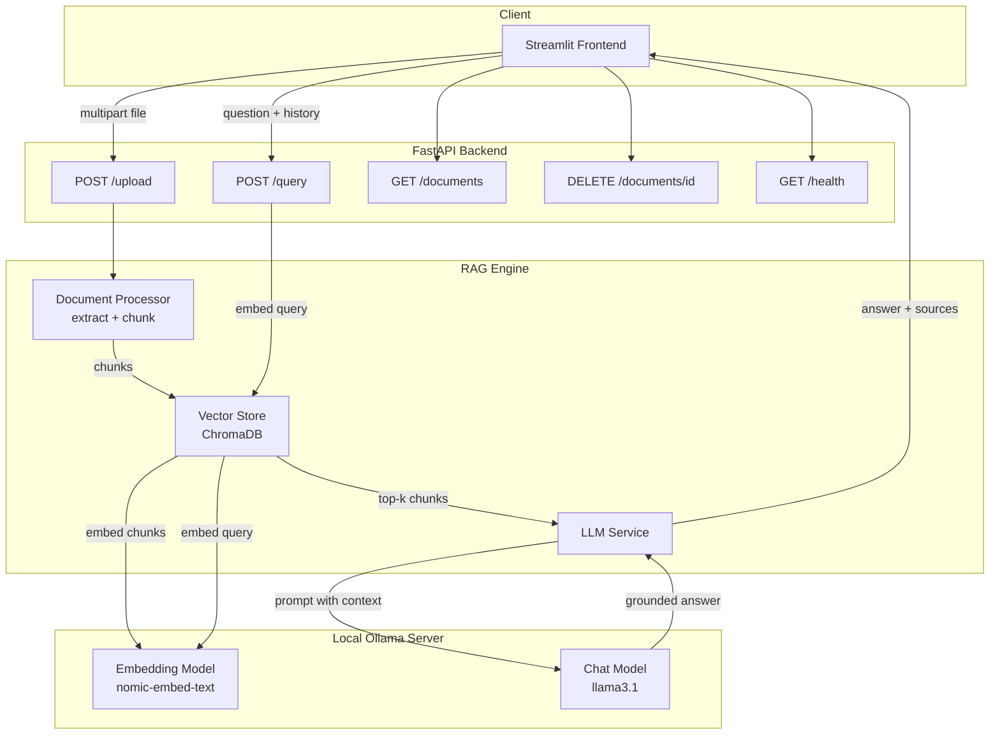

# 📚 RAG Document Assistant

A fully local, privacy-preserving **Retrieval-Augmented Generation (RAG)** system that lets you upload documents (PDF, DOCX, TXT, Markdown) and ask natural-language questions about their content. All inference and embedding runs locally via **Ollama** — no data ever leaves your machine.

---

## Table of Contents

1. [Overview](#overview)
2. [Architecture](#architecture)
3. [Tech Stack](#tech-stack)
4. [Project Structure](#project-structure)
5. [Prerequisites](#prerequisites)
6. [Setup & Installation](#setup--installation)
7. [Running the Application](#running-the-application)
8. [API Specification](#api-specification)
9. [Configuration Reference](#configuration-reference)
10. [Exploration Notebook](#exploration-notebook)
11. [Docker Deployment](#docker-deployment)
12. [Troubleshooting](#troubleshooting)
13. [Future Improvements](#future-improvements)

---

## Overview

This project implements the **Core Track** of a RAG-powered document assistant graduation project. Users upload documents, the system chunks and embeds them into a local vector database (ChromaDB), and questions are answered by retrieving the most relevant chunks and feeding them as grounded context to a local LLM (via Ollama).

**Key features:**
- 📄 Multi-format ingestion: PDF, DOCX, TXT, Markdown
- ✂️ Configurable sliding-window chunking with overlap
- 🧠 Local embeddings via Ollama (`nomic-embed-text` by default)
- 🔍 Semantic search with ChromaDB (persistent, cosine similarity)
- 💬 Grounded answer generation with source citations
- 🗂️ Document management (list, delete) via REST API
- 🖥️ Interactive Streamlit chat UI with source inspection
- 🔌 Fully documented FastAPI backend with OpenAPI docs at `/docs`
- 🐳 Optional Docker Compose setup for one-command deployment

---

## Architecture



**Data flow summary:**

1. **Ingestion:** A file is uploaded → text extracted → split into overlapping chunks → each chunk embedded via Ollama → stored in a persistent ChromaDB collection with metadata (document id, filename, chunk index).
2. **Retrieval:** A user question is embedded the same way → ChromaDB returns the top-k most similar chunks (cosine similarity).
3. **Generation:** Retrieved chunks are inserted into a system-guided prompt instructing the LLM to answer *only* from the given context → the LLM (via Ollama) generates a grounded answer.
4. **Response:** The API returns the answer plus the exact source chunks used, so the answer's provenance is fully auditable.

---

## Tech Stack

| Layer               | Technology                          |
|---------------------|--------------------------------------|
| LLM & Embeddings    | [Ollama](https://ollama.com) (local) |
| Vector Database     | [ChromaDB](https://www.trychroma.com) (persistent client) |
| Backend API         | [FastAPI](https://fastapi.tiangolo.com) + Uvicorn |
| Frontend            | [Streamlit](https://streamlit.io) |
| Document Parsing    | `pypdf`, `python-docx` |
| Config Management   | `pydantic-settings` + `.env` |
| Containerization    | Docker / Docker Compose (optional) |

---

## Project Structure

```
rag-document-assistant/
├── README.md                     # This file
├── requirements.txt              # Python dependencies
├── .env.example                  # Environment variable template
├── .gitignore
├── config.py                     # Centralized settings (pydantic-settings)
├── docker-compose.yml            # Optional multi-container deployment
├── Dockerfile.backend
├── Dockerfile.frontend
│
├── backend/
│   ├── __init__.py
│   ├── main.py                   # FastAPI app & routes
│   ├── models.py                 # Pydantic request/response schemas
│   ├── document_processor.py     # Text extraction + chunking
│   ├── vector_store.py           # ChromaDB wrapper + Ollama embeddings
│   ├── llm_service.py            # Ollama chat generation + prompting
│   └── rag_engine.py             # Orchestrates ingest/query pipeline
│
├── frontend/
│   └── app.py                    # Streamlit chat UI
│
├── notebooks/
│   └── rag_exploration.ipynb     # Step-by-step pipeline walkthrough
│
├── data/
│   └── uploads/                  # Temporary storage for uploaded files
│
└── chroma_db/                    # Persistent vector store (created at runtime)
```

---

## Prerequisites

1. **Python 3.10+**
2. **[Ollama](https://ollama.com/download)** installed and running locally
3. Pull the required models:

```bash
ollama pull llama3.1
ollama pull nomic-embed-text
```

> You can substitute any chat model Ollama supports (e.g. `mistral`, `qwen2.5`, `phi3`) by changing `OLLAMA_MODEL` in your `.env` file. `nomic-embed-text` is recommended for embeddings, but any Ollama embedding model works.

---

## Setup & Installation

```bash
# 1. Clone / unzip the project and enter it
cd rag-document-assistant

# 2. Create and activate a virtual environment
python3 -m venv venv
source venv/bin/activate        # On Windows: venv\Scripts\activate

# 3. Install dependencies
pip install -r requirements.txt

# 4. Copy environment template and adjust if needed
cp .env.example .env

# 5. Make sure Ollama is running in a separate terminal
ollama serve
```

---

## Running the Application

You need **two** processes running simultaneously (in separate terminals), plus Ollama running in the background.

**Terminal 1 — Start the backend API:**

```bash
uvicorn backend.main:app --host 0.0.0.0 --port 8000 --reload
```

The API will be live at `http://localhost:8000`, with interactive Swagger docs at `http://localhost:8000/docs`.

**Terminal 2 — Start the frontend:**

```bash
streamlit run frontend/app.py
```

The chat UI will open at `http://localhost:8501`.

**Usage:**
1. Open the Streamlit app.
2. Use the sidebar to upload a PDF, DOCX, TXT, or Markdown file — it will be chunked and indexed automatically.
3. Ask questions in the chat box. Answers include an expandable list of the exact source chunks used.
4. Manage indexed documents (view chunk counts, delete) from the sidebar.

---

## API Specification

Base URL: `http://localhost:8000`

### `GET /health`
Returns system status, whether Ollama is reachable, and vector store stats.

**Response:**
```json
{
  "status": "ok",
  "ollama_reachable": true,
  "ollama_model": "llama3.1",
  "embedding_model": "nomic-embed-text",
  "vector_store_documents": 3,
  "vector_store_chunks": 47
}
```

### `POST /upload`
Uploads and indexes a document. `multipart/form-data` with a `file` field.

```bash
curl -X POST http://localhost:8000/upload \
  -F "file=@./example_report.pdf"
```

**Response:**
```json
{
  "document_id": "6f1a2e3c-...",
  "filename": "example_report.pdf",
  "chunks_created": 18,
  "status": "indexed"
}
```

### `POST /query`
Asks a question grounded in the indexed documents.

```bash
curl -X POST http://localhost:8000/query \
  -H "Content-Type: application/json" \
  -d '{
        "question": "What were the main findings in Q3?",
        "top_k": 4
      }'
```

**Response:**
```json
{
  "answer": "According to the report, the main findings in Q3 were...",
  "sources": [
    {
      "document_id": "6f1a2e3c-...",
      "filename": "example_report.pdf",
      "chunk_index": 5,
      "text": "In Q3, revenue grew by 12%...",
      "similarity_score": 0.8421
    }
  ],
  "model_used": "llama3.1",
  "chunks_retrieved": 4
}
```

Optional `chat_history` field supports multi-turn conversations:
```json
{
  "question": "And what about Q4?",
  "chat_history": [
    {"role": "user", "content": "What were the main findings in Q3?"},
    {"role": "assistant", "content": "According to the report..."}
  ]
}
```

### `GET /documents`
Lists all indexed documents with chunk counts.

```json
{
  "documents": [
    {"document_id": "6f1a2e3c-...", "filename": "example_report.pdf", "chunk_count": 18, "file_type": ".pdf"}
  ],
  "total_documents": 1,
  "total_chunks": 18
}
```

### `DELETE /documents/{document_id}`
Removes a document and all its chunks from the vector store.

```bash
curl -X DELETE http://localhost:8000/documents/6f1a2e3c-...
```

```json
{"document_id": "6f1a2e3c-...", "status": "deleted", "chunks_removed": 18}
```

---

## Configuration Reference

All settings live in `.env` (copy from `.env.example`):

| Variable | Default | Description |
|---|---|---|
| `OLLAMA_BASE_URL` | `http://localhost:11434` | Ollama server address |
| `OLLAMA_MODEL` | `llama3.1` | Chat/generation model |
| `OLLAMA_EMBED_MODEL` | `nomic-embed-text` | Embedding model |
| `CHROMA_PERSIST_DIR` | `./chroma_db` | On-disk path for the vector store |
| `CHROMA_COLLECTION_NAME` | `documents` | Chroma collection name |
| `CHUNK_SIZE` | `800` | Words per chunk |
| `CHUNK_OVERLAP` | `120` | Overlapping words between chunks |
| `TOP_K_RESULTS` | `4` | Chunks retrieved per query |
| `BACKEND_HOST` / `BACKEND_PORT` | `0.0.0.0` / `8000` | FastAPI bind address |
| `UPLOAD_DIR` | `./data/uploads` | Temp storage for uploads |
| `MAX_UPLOAD_SIZE_MB` | `25` | Max file size accepted |
| `BACKEND_API_URL` | `http://localhost:8000` | Used by the Streamlit frontend to reach the API |

---

## Exploration Notebook

`notebooks/rag_exploration.ipynb` walks through the pipeline manually and independently of the API — useful for demos, debugging, or extending the system:

1. Verifies Ollama connectivity and required models
2. Chunks a sample text and inspects the chunks
3. Generates and inspects a raw embedding vector
4. Stores chunks in a temporary Chroma collection and runs a similarity search
5. Runs a full retrieve-then-generate RAG query and prints the grounded answer with its sources
6. Cleans up the temporary collection

Launch it with:
```bash
jupyter notebook notebooks/rag_exploration.ipynb
```

---

## Docker Deployment

A `docker-compose.yml` is provided to run Ollama, the backend, and the frontend together:

```bash
docker compose up --build
```

Then pull the models inside the Ollama container once it's up:
```bash
docker exec -it rag-ollama ollama pull llama3.1
docker exec -it rag-ollama ollama pull nomic-embed-text
```

- Backend: `http://localhost:8000`
- Frontend: `http://localhost:8501`
- Ollama: `http://localhost:11434`

---

## Troubleshooting

| Symptom | Likely Cause | Fix |
|---|---|---|
| `ollama_reachable: false` on `/health` | Ollama isn't running | Run `ollama serve` in a terminal |
| Upload fails with "No extractable text" | Scanned/image-only PDF with no text layer | Use an OCR tool to convert it first (not covered by this project) |
| Very slow answers | Large chat model on CPU-only hardware | Use a smaller model (e.g. `phi3`, `llama3.2:1b`) or enable GPU acceleration in Ollama |
| `Unsupported file type` error | File extension not in `.pdf/.docx/.txt/.md` | Convert the file or extend `SUPPORTED_EXTENSIONS` in `document_processor.py` |
| Frontend shows "Backend unreachable" | FastAPI server not running or wrong `BACKEND_API_URL` | Start `uvicorn backend.main:app` and verify the port matches `.env` |
| Embedding dimension mismatch after switching embed models | ChromaDB collection was built with a different embedding model | Delete the `chroma_db/` directory and re-ingest documents |

---

## Future Improvements

- Streaming answers token-by-token in the Streamlit UI (backend already supports `generate_answer_stream`)
- Re-ranking retrieved chunks with a cross-encoder for higher precision
- Support for scanned PDFs via OCR (e.g. `pytesseract`)
- Multi-collection support for per-user or per-project document spaces
- Authentication/authorization on the FastAPI endpoints
- Hybrid search (BM25 + vector similarity) for improved retrieval on keyword-heavy queries
